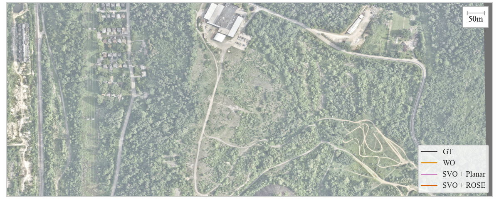

# ROSE: Robust Off-road wheel odometry with Slip Estimation

This is the public repository for ROSE, a factor for incorporating wheel odometry measurements into factors graphs to provide increased accuracy, redundancy, and robustness.

<p align="center">

</p>

ROSE does this by integration wheel odometry in 6D using a piecewise planar method, as well as estimating slip and wheel intrinsics online. To learn more, please checkout our paper (TODO: Insert link).

## Building

By default, ROSE only builds the wheel factors for usage in gtsam. It's only dependency when used like this is [gtsam 4.2](https://github.com/borglab/gtsam/releases/tag/4.2). This can be done simply using cmake,

```bash
mkdir build
cd build
cmake .. -DCMAKE_BUILD_TYPE=Release
make
sudo make install
```

If you are interested in running our experimental setup, you'll need a [slightly custom version of gtsam](https://github.com/contagon/gtsam/tree/my-helpers-4.2) and the latest version of [JRL](https://github.com/DanMcGann/jrl). Once you have the python wrappers for both of these installed, things are built identically using cmake and make,

```bash
mkdir build
cd build
cmake .. -DCMAKE_BUILD_TYPE=Release -DEXPERIMENTS=ON
make
sudo make install
```

## Citation

If citing, please reference TODO

## TODO

- [ ] Clean up wheel factor code, it's a bit messy
- [ ] Fill out TODOs here once published (at least on arxiv)
- [ ] Figure out licensing stuff
